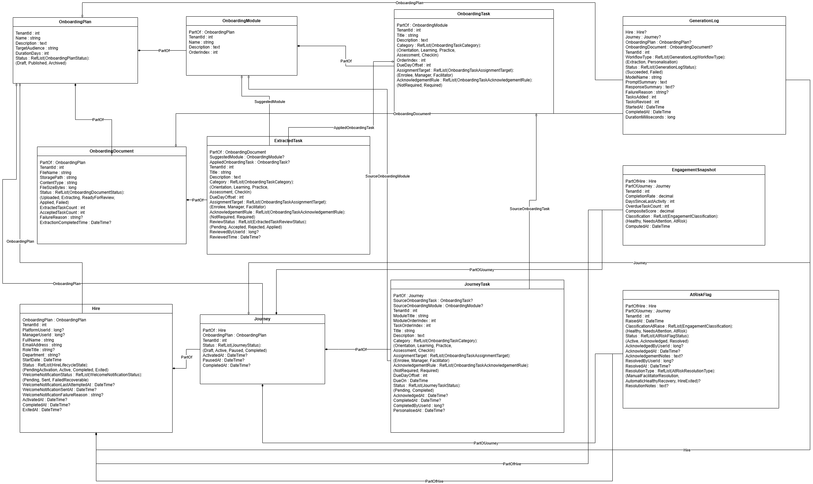

# JourneyPoint

[](https://github.com/hashimaziz88/JourneyPoint/actions/workflows/backend-ci.yml)
[](https://github.com/hashimaziz88/JourneyPoint/actions/workflows/frontend-ci.yml)

## What is JourneyPoint?

JourneyPoint is a multi-tenant onboarding platform designed to transform the way organisations onboard new hires. With a structured and data-driven approach, our application empowers facilitators to create reusable onboarding plans, enrol new hires into personalised journeys, and track engagement, wellness, and completion throughout the onboarding lifecycle.

## Problem Statement

HR onboarding — whether a government department onboarding a new public servant, a consultancy running a graduate intake, or a technology company inducting new developers — shares the same fundamental problem: the plan lives somewhere static, progress is tracked somewhere manual, and nobody knows who is falling behind until it is too late to help them.

### The Current State — Boxfusion

Boxfusion's graduate onboarding programme is a 69-day, 13-week curriculum covering frontend development, SQL, backend development, Shesha, and agentic programming. It is well-structured and well-documented — but the documentation lives in a static Azure DevOps wiki as a series of markdown tables.

- Progress is tracked in an Excel spreadsheet — updated manually when a facilitator remembers to
- The wiki does not know whether a graduate has completed the JavaScript module
- There is no early warning when someone has not touched their project for four days
- Content from uploaded project specs or training documents must be manually re-entered as tasks
- When a new intake begins, the HR facilitator recreates the onboarding plan from scratch or copies a spreadsheet
- There is no view that shows the full intake's progress at a glance — no pattern recognition across hires

### The Current State — Government (MyMzansi Context)

South Africa employs over 1.2 million public servants across national and provincial government. MyMzansi Initiative 4.3 identifies the absence of a unified government HR system as a blocker to effective public service delivery — with a milestone to launch a new integrated HR management system for government departments by Q4 2027. That system does not yet exist.

- New public servants typically receive a policy document and a manager who is too busy to provide structured guidance
- There is no structured onboarding journey, no automated delivery mechanism, and no tracking
- Departments with the worst service delivery records are often those where onboarding is entirely ad-hoc
- No system exists to detect when a new hire has disengaged before their probation review

### Root Cause

The problem is not a lack of HR capacity or content — Boxfusion's wiki and government policy documents contain exactly the right material. The problem is that the content is inert. It does not deliver itself. It does not track itself. It does not adapt to new material. And it does not surface problems early.

**The insight JourneyPoint is built on:** every hire in the same role in the same organisation needs roughly the same structured journey. That journey can be defined once, enriched with real content from existing documents, delivered automatically, and monitored intelligently. The facilitator's job becomes oversight and intervention — not logistics and data entry.

## Why Choose JourneyPoint?

Structured Onboarding: Facilitators build reusable plan templates with modules and tasks, automatically generating personalised journey plans for each new hire.

AI-Assisted Enrichment: Facilitators can upload documents such as PDFs, images, and markdown files to have Groq extract structured onboarding content — with full human review before anything is applied.

Engagement Monitoring: JourneyPoint tracks hire progress through composite engagement scores, classification labels, and active at-risk flags, enabling early facilitator intervention when a hire is falling behind.

Wellness Tracking: Scheduled wellness check-ins at key milestones (Day 1, Day 2, Week 1, then monthly) let hires self-report wellbeing with AI-generated questions and answer suggestions. Facilitators and managers can review completed check-ins and AI insight summaries.

Multi-Tenant Isolation: Each organisation operates in complete isolation — tenants see only their own data, users, and plans, with no cross-tenant data leakage.

Role-Aware Workflows: Facilitator, Manager, and Enrolee views each have purpose-built dashboards and task flows tailored to their responsibilities within the onboarding process.

## Documentation

### Software Requirement Specification

#### Specification Document

[View Spec Document](https://drive.google.com/file/d/16LNdBIP9ijmweslzHh5AwktbE43vlcyE/view?usp=sharing)

#### Overview

JourneyPoint is a multi-tenant onboarding platform designed to transform the way organisations onboard new hires. With a structured and data-driven approach, our application empowers facilitators to create reusable onboarding plans, enrol new hires into personalised journeys, and track engagement and completion throughout the onboarding lifecycle.

#### Components and Functional Requirements

##### 1. Authentication and Authorisation Management

- User can log into the JourneyPoint web application
- User can access their role-specific dashboard after login
- Admin can create and manage user accounts across tenants

##### 2. Plan Management

- Facilitator can create and edit onboarding plan templates
- Facilitator can add, edit, and remove modules within a plan
- Facilitator can add, edit, and remove tasks within a module
- Facilitator can import plan content from uploaded documents (PDF, image, markdown)
- Facilitator can use AI-assisted enrichment to extract structured content from documents

##### 3. Hire Management

- Facilitator can create a new hire record
- System automatically creates a platform user account on hire creation
- Welcome email with temporary credentials is dispatched via SMTP when configured
- Facilitator can view and manage all hires on a pipeline board
- Facilitator can view detailed hire information including lifecycle status and notification delivery state

##### 4. Journey Management

- Facilitator can generate a personalised journey plan for a hire from a selected plan template
- Facilitator can review and edit draft journey tasks before activation
- Facilitator can add draft tasks to a generated journey
- Facilitator can activate a journey to make it visible to the hire
- Enrolee can view their active journey and complete assigned tasks
- Manager can view direct report task workspaces
- Manager can view wellness check-ins for their assigned hires

##### 5. Engagement and Intervention

- System tracks hire engagement and calculates a composite engagement score
- Facilitator can view score trend charts and engagement snapshots
- Facilitator can raise an at-risk flag for a hire showing signs of disengagement
- Facilitator can resolve an at-risk flag and record an intervention
- Facilitator can view full intervention history per hire

##### 6. Wellness Tracking

- System generates scheduled wellness check-ins at key milestones when a journey is activated
- AI generates tailored wellness questions for each check-in period
- Enrolee can answer questions and request AI-generated answer suggestions
- Enrolee can submit a completed check-in
- Facilitator and Manager can review check-in responses and AI insight summaries
- Wellness views display hire context including name, role, department, and start date

##### 7. Multi-Tenancy

- Platform supports multiple isolated tenant organisations
- Tenant admin can manage users within their own tenant
- All data is fully isolated per tenant

## Design

### Wireframes

[View Figma Designs](https://www.figma.com/make/5T4QDMFiOFLpOOPql1HhXN/JourneyPoint)

### Domain Model

[View Domain Model Online](https://drive.google.com/file/d/1kv56O3XnyTrqi7bkaZcj1aX3mcpPtyru/view?usp=sharing)


## Running the Application

### Frontend

```bash
npm install
```

#### Development

```bash
npm run dev
```

#### Production

```bash
npm run build
npm run start
```

Refer to [journeypoint/README.md](journeypoint/README.md) for more detailed instructions to run the frontend.

### Backend

```bash
# Configure connection string and secrets in:
# aspnet-core/src/JourneyPoint.Web.Host/appsettings.json

# Apply database migrations
dotnet run --project aspnet-core/src/JourneyPoint.Migrator

# Start the API server (Swagger available after start)
dotnet run --project aspnet-core/src/JourneyPoint.Web.Host
```

Refer to [aspnet-core/README.md](aspnet-core/README.md) for more detailed instructions to run the backend.

### Frontend CI

```bash
npm run lint
npm run build
npm run test:e2e
```
